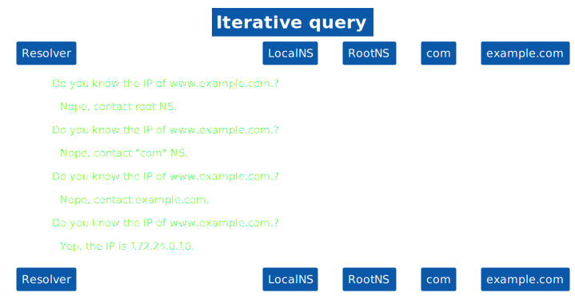
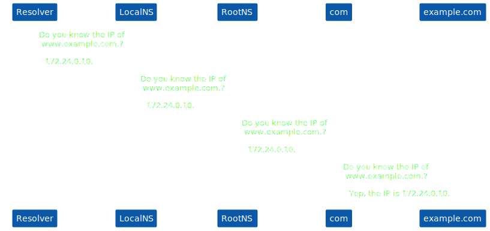
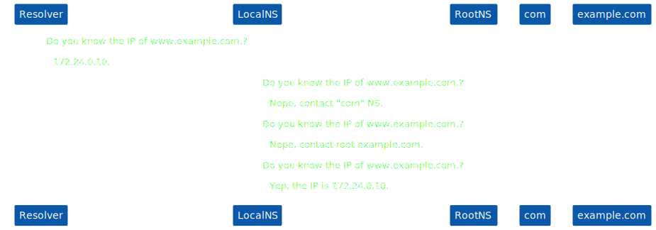

# DNS.
Domain Name Service is used for name resolution, returns IP addresses for FQDNs (Fully Qualified Domain Name). 

Isolates (minimize) the effects of changing IP addresses.

Reverse name resolution, returns the FQDNs for IP addresses.

# Top level domains.
gov, net, com, org, mil, edu, arpa, br ...

# Domain structure.
Root domain -> root servers

Top level domains -> org, com, net, br, us, arpa ...

Second level/Authoritative domains -> google, yahoo ... (www, mail, download)

# DNS namespace.
Generic top level domains (gTLs) -> edu, gov, org ...

Country code top level domains (ccTLDs) -> us, br, pt ...

arpa -> used for reverse resolution.

# DNS zone.
A DNS zone is a portion of the DNS namespace that is managed by a specific organization or administrator. A DNS zone is an administrative space, which allows for more granular control of DNS components, such as authoritative nameservers. The domain name space is a hierarchical tree, with the DNS root domain at the top.

# DNS server types.
- Master: get zone data from locally stored files. Usually one master server for a zone. All changes are made in master servers.

- Slave: get mirror zone data from master servers through zone transfer. They are read only. Checks periodically for updates in master servers (as specified in SOA record)

- Caching only: do not have any data in zone files. Simply accept request and forward them. Keep results in cache. 

# Types of queries. 
## Iterative query.

More load on the resolvers.

## Recursive query.

Adds load on top level domain servers.

## Hybrid query.

