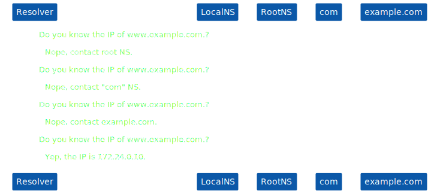

# DNS.
Domain Name Service is used for name resolution, returns IP addresses for FQDNs (Fully Qualified Domain Name). 
Isolates (minimize) the effects of changing IP addresses.
Reverse name resolution, returns the FQDNs for IP addresses.

# DNS zone.
A DNS zone is a portion of the DNS namespace that is managed by a specific organization or administrator. A DNS zone is an administrative space, which allows for more granular control of DNS components, such as authoritative nameservers. The domain name space is a hierarchical tree, with the DNS root domain at the top.

# Root domains.
The DNS root zone is served by thirteen root server clusters which are authoritative for queries to the top-level domains of the Internet. Thus, every name resolution either starts with a query to a root server or uses information that was once obtained from a root server.

The root servers clusters have the official names a.root-servers.net to m.root-servers.net. To resolve these names into addresses, a DNS resolver must first find an authoritative server for the net zone. To avoid this circular dependency, the address of at least one root server must be known for bootstrapping access to the DNS. For this purpose operating systems or DNS server or resolver software packages typically include a file with all addresses of the DNS root servers.

# Top level domains.
A top-level domain (TLD) is one of the domains at the highest level in the hierarchical Domain Name System of the Internet after the root domain.

Groups of top-level domains:
- Infrastructure top-level domain (ARPA);
- Generic top-level domains;
- Generic restricted top-level domains;
- Sponsored top-level domains;
- Country-code top-level domains;
- Internationalized country code top-level domains;
- Test top-level domains;

# Authoritative domains.
An authoritative name server is a name server that gives answers in response to questions asked about names in a zone. An authoritative-only name server returns answers only to queries about domain names that have been specifically configured by the administrator.

# DNS server types.
- Master: get zone data from locally stored files. Usually one master server for a zone. All changes are made in master servers.
- Slave: get mirror zone data from master servers through zone transfer. They are read only. Checks periodically for updates in master servers (as specified in SOA record)
- Caching only: do not have any data in zone files. Simply accept request and forward them. Keep results in cache. 

# Types of queries. 
## Iterative query.

More load on the resolvers.

## Recursive query.

Adds load on top level domain servers.

## Hybrid query.

